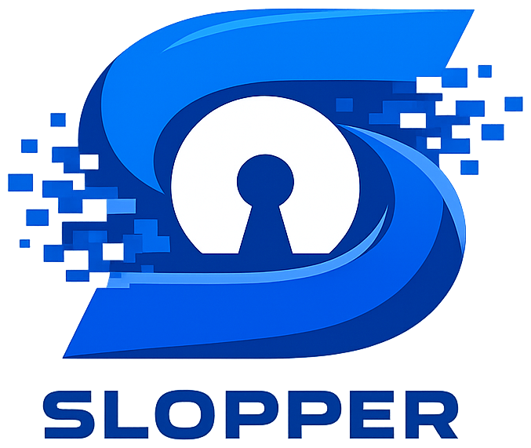

<p align="center">
  
</p>

<h3 align="center">Keep AI slop out of your pull requests.</h3>

<p align="center">
  <a href="https://github.com/malvads/slopper/actions"></a>
  <a href="https://github.com/marketplace/actions/slopper"></a>
  
  <a href="https://github.com/malvads/slopper/blob/main/LICENSE"></a>
</p>

---

Open source is under siege. AI-generated "slop" contributions — mass-produced PRs that look plausible but introduce subtle bugs, unnecessary complexity, and zero-value changes — are flooding repositories at unprecedented scale. They pass CI. They have polished descriptions. And they erode codebases from the inside.

**Slopper fights slop with AI.** It analyzes every pull request holistically — author reputation, commit patterns, code quality, and behavioral signals — and surfaces what human reviewers miss. It never blocks merging. It informs. It labels. You make the call.

## Quick Start

```yaml
name: Slopper
on:
  pull_request:
    types: [opened, synchronize, reopened]
  issue_comment:
    types: [created]

jobs:
  analyze:
    runs-on: ubuntu-latest
    permissions:
      contents: write
      pull-requests: write
    steps:
      - uses: malvads/slopper@v1
        with:
          ai-provider: 'openai'
          openai-api-key: ${{ secrets.OPENAI_API_KEY }}
          github-token: ${{ secrets.GITHUB_TOKEN }}
```

## Providers

Slopper supports five AI providers. Pick the one you already have an API key for.

**OpenAI** uses `gpt-4o` by default. Pass your key via `openai-api-key`.
**Anthropic** uses `claude-sonnet-4-6` by default. Pass your key via `anthropic-api-key`.
**Vertex AI** uses `claude-sonnet-4-6` by default. Pass your project ID via `vertex-project-id`.
**Groq** uses `llama-3.3-70b-versatile` by default. Pass your key via `groq-api-key`.
**Gemini** uses `gemini-2.5-flash` by default. Pass your key via `gemini-api-key`.

You can override the default model with the `model` input:

```yaml
- uses: malvads/slopper@v1
  with:
    ai-provider: 'anthropic'
    model: 'claude-haiku-4-5'
    anthropic-api-key: ${{ secrets.ANTHROPIC_API_KEY }}
    github-token: ${{ secrets.GITHUB_TOKEN }}
```

<details>
<summary>All provider examples</summary>

**OpenAI**
```yaml
- uses: malvads/slopper@v1
  with:
    ai-provider: 'openai'
    openai-api-key: ${{ secrets.OPENAI_API_KEY }}
    github-token: ${{ secrets.GITHUB_TOKEN }}
```

**Anthropic**
```yaml
- uses: malvads/slopper@v1
  with:
    ai-provider: 'anthropic'
    anthropic-api-key: ${{ secrets.ANTHROPIC_API_KEY }}
    github-token: ${{ secrets.GITHUB_TOKEN }}
```

**Vertex AI** — requires [Workload Identity Federation](https://github.com/google-github-actions/auth)
```yaml
- uses: malvads/slopper@v1
  with:
    ai-provider: 'vertex'
    vertex-project-id: ${{ secrets.VERTEX_PROJECT_ID }}
    vertex-region: 'global'
    github-token: ${{ secrets.GITHUB_TOKEN }}
```

**Groq**
```yaml
- uses: malvads/slopper@v1
  with:
    ai-provider: 'groq'
    groq-api-key: ${{ secrets.GROQ_API_KEY }}
    github-token: ${{ secrets.GITHUB_TOKEN }}
```

**Gemini**
```yaml
- uses: malvads/slopper@v1
  with:
    ai-provider: 'gemini'
    gemini-api-key: ${{ secrets.GEMINI_API_KEY }}
    github-token: ${{ secrets.GITHUB_TOKEN }}
```

</details>

## What It Detects

Slopper's detection patterns come from real incidents reported by maintainers of curl, the Linux kernel, Godot, Jazzband, Node.js, and others.

### Quality Signals

**Phantom fixes** catch PRs that fix bugs that don't exist or solve unreported problems, something curl maintainers deal with regularly. **Well-formed noise** spots code with clean syntax and consistent naming that still has subtle logic errors and missing edge cases, a pattern Godot contributors have flagged. **Boilerplate inflation** identifies generic commit messages and templated PR descriptions that don't match the actual diff, seen across curl and Node.js. **Unnecessary refactoring** flags refactors that add complexity without benefit — GitClear data shows AI-generated code produces 9x more churn. **Cosmetic disguises** are whitespace and formatting changes dressed up as meaningful improvements. **Duplicate functionality** catches code that reimplements something already in the codebase. **Documentation slop** flags docs that restate the obvious or add boilerplate READMEs. **Convention breaking** identifies changes that ignore project patterns in favor of "textbook" alternatives, a recurring complaint from Godot maintainers.

### Author Signals

**Spray-and-pray** detects accounts submitting 100+ PRs across dozens of unrelated repos in days, like the Kai Gritun incident. **Reputation farming** spots patterns of building merge credits to gain trust before targeting critical infrastructure, as seen with the Cloudflare Workers SDK. **New account bursts** flags fresh accounts submitting to established projects with no prior engagement. **Holiday timing** watches for bursts of PRs during holidays and weekends when maintainers are less vigilant, a tactic reported by Node.js maintainers. **No engagement** flags authors who never respond to review comments or participate in issues. **Description mismatch** catches PR descriptions that don't align with what the diff actually does.

### Security Signals

Slopper also watches for **obfuscation** like base64 blobs and hex-encoded strings, **dynamic execution** via eval or Function constructors, **hardcoded secrets** and API keys, **suspicious URLs** pointing to raw IPs, **CI tampering** in workflow files, and **dependency hijacking** through unexpected packages or changed registries.

## Configuration

Create a `.slopper` file in your repository root to customize behavior. Supports full YAML or plain text (legacy).

```yaml
# .slopper

vouched:
  - octocat
  - trusted-contributor
  - dependabot[bot]

actions:
  auto_close:
    enabled: false
    threshold: 9
    comment: "This PR was automatically closed by Slopper due to critical risk score."
  auto_approve:
    enabled: false
    threshold: 2
  auto_request_review:
    enabled: false
    threshold: 6
    reviewers:
      - security-team-lead
      - senior-maintainer

thresholds:
  low: 2
  medium: 5
  high: 8

ignore_paths:
  - "*.md"
  - "docs/**"
  - "LICENSE"
  - "**/*.test.ts"

rules:
  require_description: false
  require_linked_issue: false
  max_files_changed: 0
  block_first_time_contributors: false
```

The `vouched` list contains contributors who bypass AI analysis entirely. Under `actions`, you can auto-close PRs that exceed a risk threshold, auto-approve low-risk PRs with high confidence, or automatically request reviewers when the score is concerning. The `thresholds` section lets you customize where the boundaries between low, medium, high, and critical risk sit. Use `ignore_paths` to exclude files from analysis (markdown, docs, tests, etc.). The `rules` section adds PR hygiene checks: flag PRs with empty descriptions, require linked issues, cap the number of changed files, or block first-time contributors entirely.

Every field is optional. Missing fields use sensible defaults. If you just need a vouched list, the legacy plain text format still works:

```
octocat
trusted-contributor
dependabot[bot]
```

## Pipeline

When a PR is opened, Slopper runs through a series of steps. First it loads the `.slopper` config, then checks if the author is vouched (skipping analysis if so). Otherwise it collects PR metadata, filters out ignored files, sends everything to the AI provider via structured tool calling, computes labels deterministically from the result, posts a comment, and finally executes any configured auto-actions like closing or requesting reviewers.

```
Load config -> Vouch check -> Collect data -> AI analysis -> Labels -> Comment -> Auto-actions
```

## Labels

Labels are computed deterministically from the analysis result, never suggested by the AI.

`slopper/risk/low` for scores 0 through 2, `slopper/risk/medium` for 3 through 5, `slopper/risk/high` for 6 through 8, and `slopper/risk/critical` for 9 and 10. These boundaries are configurable via the `thresholds` section in `.slopper`.

`slopper/approved` is applied when the risk score falls within the low range and confidence is high. `slopper/vouched` marks PRs from authors in the vouched list. `slopper/first-time-contributor` flags authors with no prior PRs or issues in the repo.

`slopper/ci-modified` and `slopper/dependencies-modified` are applied when CI/workflow files or dependency lockfiles are changed. `slopper/needs-security-review` triggers at score 6 or above, and `slopper/suspicious` at 8 or above.

When hygiene rules are enabled, `slopper/missing-description` flags PRs with empty bodies, `slopper/no-linked-issue` flags PRs without an issue reference, and `slopper/too-many-files` flags PRs that exceed the configured file limit.

If the AI analysis fails for any reason, `slopper/analysis-failed` is applied instead.

## Vouching

Code owners can permanently whitelist trusted contributors by commenting `/slopper vouch` on a PR. Slopper verifies the commenter is in `CODEOWNERS` or has admin/maintain permissions, then adds the author to the `.slopper` file. Future PRs from that author skip AI analysis entirely.

When an author has a perfect score (risk 0, high confidence, trusted), Slopper proactively suggests vouching them.

## PR Comments

Slopper posts a single comment on each analyzed PR with the risk score, confidence level, and a summary of findings. Collapsible sections break down the author, commit, code, and behavioral assessments. Review suggestions are listed as a checklist. Applied labels are shown at the bottom, along with a vouch suggestion for highly trusted authors when applicable.

Comments are upserted on re-runs, never duplicated.

## Inputs

The `ai-provider` input selects which provider to use (defaults to `openai`). Use `model` to override the default model. Each provider needs its own API key: `openai-api-key`, `anthropic-api-key`, `vertex-project-id` (with optional `vertex-region`), `groq-api-key`, or `gemini-api-key`. The `github-token` is always required and defaults to `${{ github.token }}`.

## Outputs

Slopper sets four outputs after analysis: `risk-score` (0 to 10), `risk-level` (`low`, `medium`, `high`, or `critical`), `confidence` (`low`, `medium`, or `high`), and `labels` (comma-separated list of all applied labels). Use these in subsequent workflow steps to gate deployments or trigger notifications.

## Development

```bash
npm install
npm run build
npm run test
npm run package
npm run all
```

## License

MIT
