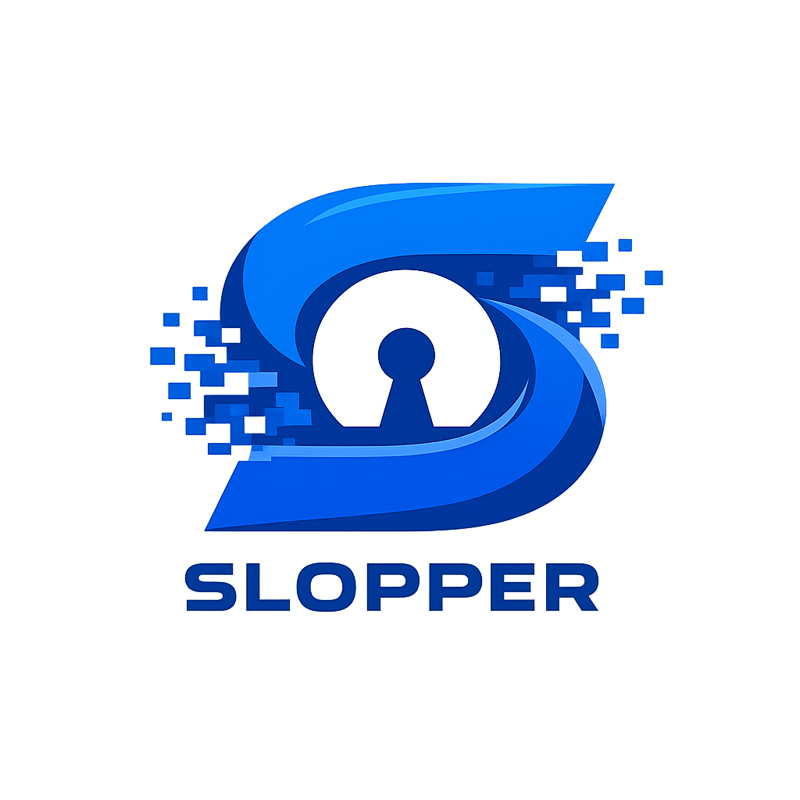

<p align="center">
  
</p>

<h3 align="center">Keep AI slop out of your pull requests.</h3>

<p align="center">
  <a href="https://github.com/malvads/slopper/actions"></a>
  <a href="https://github.com/marketplace/actions/slopper"></a>
  
  <a href="https://github.com/malvads/slopper/blob/main/LICENSE"></a>
</p>

---

Open source is under siege. AI-generated "slop" contributions — mass-produced PRs that look plausible but introduce subtle bugs, unnecessary complexity, and zero-value changes — are flooding repositories at unprecedented scale. They pass CI. They have polished descriptions. And they erode codebases from the inside.

**Slopper fights slop with AI.** It analyzes every pull request holistically — author reputation, commit patterns, code quality, and behavioral signals — and surfaces what human reviewers miss. It never blocks merging. It informs. It labels. You make the call.

## Quick Start

```yaml
name: Slopper
on:
  pull_request:
    types: [opened, synchronize, reopened]
  issue_comment:
    types: [created]

jobs:
  analyze:
    runs-on: ubuntu-latest
    permissions:
      contents: write
      pull-requests: write
    steps:
      - uses: malvads/slopper@v1
        with:
          ai-provider: 'openai'
          openai-api-key: ${{ secrets.OPENAI_API_KEY }}
          github-token: ${{ secrets.GITHUB_TOKEN }}
```

## Providers

| Provider | Default Model | Key Input |
|----------|---------------|-----------|
| **OpenAI** | `gpt-4o` | `openai-api-key` |
| **Anthropic** | `claude-sonnet-4-6` | `anthropic-api-key` |
| **Vertex AI** | `claude-sonnet-4-6` | `vertex-project-id` |
| **Groq** | `llama-3.3-70b-versatile` | `groq-api-key` |
| **Gemini** | `gemini-2.5-flash` | `gemini-api-key` |

Override the default model with the `model` input:

```yaml
- uses: malvads/slopper@v1
  with:
    ai-provider: 'anthropic'
    model: 'claude-haiku-4-5'
    anthropic-api-key: ${{ secrets.ANTHROPIC_API_KEY }}
    github-token: ${{ secrets.GITHUB_TOKEN }}
```

<details>
<summary>All provider examples</summary>

**OpenAI**
```yaml
- uses: malvads/slopper@v1
  with:
    ai-provider: 'openai'
    openai-api-key: ${{ secrets.OPENAI_API_KEY }}
    github-token: ${{ secrets.GITHUB_TOKEN }}
```

**Anthropic**
```yaml
- uses: malvads/slopper@v1
  with:
    ai-provider: 'anthropic'
    anthropic-api-key: ${{ secrets.ANTHROPIC_API_KEY }}
    github-token: ${{ secrets.GITHUB_TOKEN }}
```

**Vertex AI** — requires [Workload Identity Federation](https://github.com/google-github-actions/auth)
```yaml
- uses: malvads/slopper@v1
  with:
    ai-provider: 'vertex'
    vertex-project-id: ${{ secrets.VERTEX_PROJECT_ID }}
    vertex-region: 'global'
    github-token: ${{ secrets.GITHUB_TOKEN }}
```

**Groq**
```yaml
- uses: malvads/slopper@v1
  with:
    ai-provider: 'groq'
    groq-api-key: ${{ secrets.GROQ_API_KEY }}
    github-token: ${{ secrets.GITHUB_TOKEN }}
```

**Gemini**
```yaml
- uses: malvads/slopper@v1
  with:
    ai-provider: 'gemini'
    gemini-api-key: ${{ secrets.GEMINI_API_KEY }}
    github-token: ${{ secrets.GITHUB_TOKEN }}
```

</details>

## What It Detects

Slopper's detection patterns are based on real incidents reported by maintainers of curl, the Linux kernel, Godot, Jazzband, Node.js, and others.

### Quality Signals

| Signal | What it catches | Seen in |
|--------|----------------|---------|
| Phantom fixes | PRs that fix bugs that don't exist or solve unreported problems | curl |
| Well-formed noise | Clean syntax, consistent naming, but subtle logic errors and missing edge cases | Godot |
| Boilerplate inflation | Generic commit messages and templated PR descriptions that don't match the diff | curl, Node.js |
| Unnecessary refactoring | Refactors that add complexity without benefit — AI code generates 9x more churn | GitClear data |
| Cosmetic disguises | Whitespace/formatting changes presented as meaningful improvements | widespread |
| Duplicate functionality | Code that reimplements something that already exists in the codebase | widespread |
| Documentation slop | Docs that restate the obvious or add boilerplate READMEs | widespread |
| Convention breaking | Changes that ignore project patterns in favor of "textbook" alternatives | Godot |

### Author Signals

| Signal | What it catches | Seen in |
|--------|----------------|---------|
| Spray-and-pray | 100+ PRs across dozens of unrelated repos in days | Kai Gritun incident |
| Reputation farming | Building merge credits to gain trust in critical infrastructure | Cloudflare Workers SDK |
| New account bursts | Fresh accounts submitting PRs to established projects with no prior engagement | widespread |
| Holiday timing | Bursts of PRs during holidays/weekends when maintainers are less vigilant | Node.js |
| No engagement | Authors who never respond to review comments or participate in issues | curl, Godot |
| Description mismatch | PR description doesn't align with what the diff actually does | curl |

### Security Signals

| Signal | What it catches |
|--------|----------------|
| Obfuscation | Base64 blobs, hex-encoded strings, minified code in non-minified contexts |
| Dynamic execution | eval, exec, Function constructor in unusual contexts |
| Secrets | Hardcoded credentials, API keys, tokens in source code |
| Suspicious URLs | URLs pointing to raw IPs or untrusted domains |
| CI tampering | Changes to CI/CD pipelines that could enable code execution |
| Dependency hijack | Unexpected packages, changed registries, typosquatting |

## Configuration

Create a `.slopper` file in your repository root to customize behavior. Supports full YAML or plain text (legacy).

```yaml
# .slopper

# Vouched contributors bypass AI analysis entirely
vouched:
  - octocat
  - trusted-contributor
  - dependabot[bot]

# Automated actions based on analysis results
actions:
  auto_close:
    enabled: false
    threshold: 9          # Close PRs with risk score >= this value
    comment: "This PR was automatically closed by Slopper due to critical risk score."
  auto_approve:
    enabled: false
    threshold: 2          # Approve PRs with risk score <= this value (requires high confidence)
  auto_request_review:
    enabled: false
    threshold: 6          # Request reviewers for PRs with risk score >= this value
    reviewers:
      - security-team-lead
      - senior-maintainer

# Customize risk score boundaries for labels
thresholds:
  low: 2                  # 0–2 = low risk
  medium: 5               # 3–5 = medium risk
  high: 8                 # 6–8 = high risk, 9–10 = critical

# Glob patterns for files to exclude from analysis
ignore_paths:
  - "*.md"
  - "docs/**"
  - "LICENSE"
  - "**/*.test.ts"

# PR hygiene rules — violations get their own labels
rules:
  require_description: false       # Label PRs with empty body
  require_linked_issue: false      # Label PRs with no issue reference (#123, fixes #123, etc.)
  max_files_changed: 0             # Label PRs exceeding this file count (0 = disabled)
  block_first_time_contributors: false  # Auto-close PRs from first-time contributors
```

**Legacy format** — a plain text list of vouched usernames is still supported:

```
# .slopper — vouched contributors bypass AI analysis
octocat
trusted-contributor
dependabot[bot]
```

Slopper auto-detects the format. If no `.slopper` file exists, all defaults are used.

## Pipeline

Each analysis step is a discrete, testable `PipelineStep` class:

```
PR opened → Load config → Vouch check → Data collection → AI analysis → Labels → Comment → Auto-actions
```

| Step | What it does |
|------|-------------|
| `LoadConfigStep` | Loads and parses the `.slopper` configuration file |
| `VouchCheckStep` | Checks vouched users from config and `/slopper vouch` commands |
| `VouchApplyStep` | If vouched, applies labels and skips analysis |
| `CollectDataStep` | Gathers PR metadata, filters files by `ignore_paths` |
| `AiAnalysisStep` | Sends context to the AI provider via structured tool calling |
| `ComputeLabelsStep` | Deterministically computes labels using configured thresholds and rules |
| `PostResultsStep` | Posts the analysis comment and applies labels |
| `AutoActionsStep` | Executes auto-close, auto-approve, and auto-request-review actions |

All providers use **structured tool calling** — the AI calls a `submit_analysis` tool with a strict JSON schema. No raw JSON parsing.

## Labels

Labels are computed deterministically from the analysis — never suggested by the AI.

| Label | Rule |
|-------|------|
| `slopper/approved` | Risk score 0–2 AND high confidence |
| `slopper/vouched` | Author vouched by a code owner |
| `slopper/risk/low` | Risk score 0–2 |
| `slopper/risk/medium` | Risk score 3–5 |
| `slopper/risk/high` | Risk score 6–8 |
| `slopper/risk/critical` | Risk score 9–10 |
| `slopper/confidence/high` | AI is highly confident |
| `slopper/confidence/medium` | Moderate confidence |
| `slopper/confidence/low` | Low confidence |
| `slopper/first-time-contributor` | No prior PRs or issues in this repo |
| `slopper/ci-modified` | CI/workflow files changed |
| `slopper/dependencies-modified` | Dependency/lockfiles changed |
| `slopper/needs-security-review` | Risk score ≥ 6 |
| `slopper/suspicious` | Risk score ≥ 8 |
| `slopper/missing-description` | PR body is empty (`require_description: true`) |
| `slopper/no-linked-issue` | No issue reference in body (`require_linked_issue: true`) |
| `slopper/too-many-files` | Files changed exceeds `max_files_changed` |
| `slopper/analysis-failed` | AI analysis encountered an error |

## Vouching

Code owners can permanently whitelist trusted contributors:

1. Comment `/slopper vouch` on a PR
2. Slopper verifies the commenter is in `CODEOWNERS` or has admin/maintain permissions
3. The author is added to the `.slopper` file
4. Future PRs from that author skip AI analysis

When an author has a perfect score (risk 0, high confidence, trusted), Slopper proactively suggests vouching them.

## PR Comments

Slopper posts a structured comment inspired by [CodeRabbit](https://www.coderabbit.ai/):

- Risk badge and metrics table
- Collapsible **Walkthrough** with author, commit, code, and behavioral assessments
- Collapsible **Review Suggestions** as a checklist
- Applied labels
- Vouch suggestion for highly trusted authors

Comments are upserted — updated on re-runs, never duplicated.

## Inputs

| Input | Required | Default | Description |
|-------|----------|---------|-------------|
| `ai-provider` | No | `openai` | `openai`, `anthropic`, `vertex`, `groq`, or `gemini` |
| `model` | No | — | Override the default model for the selected provider |
| `openai-api-key` | If OpenAI | — | OpenAI API key |
| `anthropic-api-key` | If Anthropic | — | Anthropic API key |
| `vertex-project-id` | If Vertex | — | Google Cloud project ID |
| `vertex-region` | No | `global` | Google Cloud region |
| `groq-api-key` | If Groq | — | Groq API key |
| `gemini-api-key` | If Gemini | — | Google Gemini API key |
| `github-token` | Yes | `${{ github.token }}` | GitHub token |

## Outputs

| Output | Description |
|--------|-------------|
| `risk-score` | Numeric risk score (0–10) |
| `risk-level` | `low`, `medium`, `high`, or `critical` |
| `confidence` | `low`, `medium`, or `high` |
| `labels` | Comma-separated list of applied labels |

## Development

```bash
npm install
npm run build    # compile TypeScript
npm run test     # run unit tests
npm run package  # bundle with ncc
npm run all      # build + test + package
```

## License

MIT
